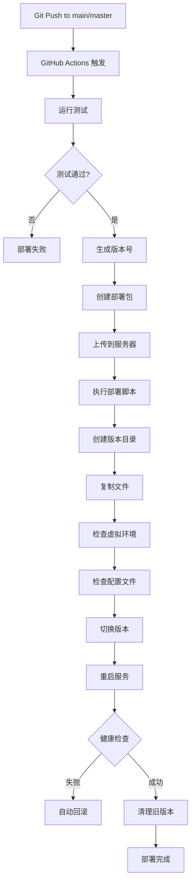
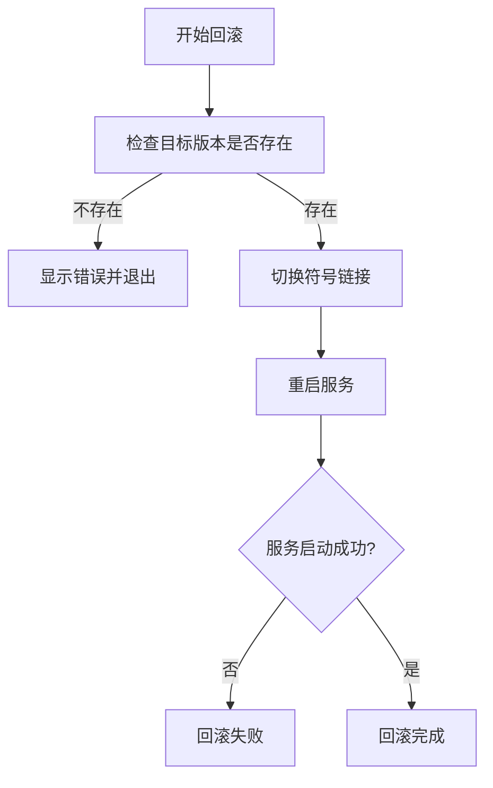

# 部署方案总览

## 📋 目录

1. [部署版本存储方案](#部署版本存储方案)
2. [新版本发布流程](#新版本发布流程)
3. [版本回滚流程](#版本回滚流程)
4. [部署架构说明](#部署架构说明)
5. [常用命令参考](#常用命令参考)

---

## 📦 部署版本存储方案

### 目录结构

```
/opt/ICBackend/                          # 部署根目录（可配置，默认 /opt/ICBackend）
├── current -> versions/20241229-120000-abc12345  # 符号链接，指向当前活跃版本
├── venv/                                # 共享虚拟环境（所有版本共享）
├── .env                                 # 共享配置文件（所有版本共享）
├── .env.secrets                         # 共享敏感配置文件（所有版本共享）
├── versions/                            # 版本目录
│   ├── 20241229-120000-abc12345/       # 版本1（格式：YYYYMMDD-HHMMSS-<git_sha>）
│   │   ├── app/                         # 应用代码
│   │   ├── requirements.txt             # 依赖文件
│   │   ├── gunicorn_config.py           # Gunicorn配置
│   │   ├── env.example                  # 环境变量示例
│   │   ├── prompts/                     # 提示词目录（可选）
│   │   ├── venv -> ../../venv           # 符号链接，指向共享虚拟环境
│   │   ├── .env -> ../../.env           # 符号链接，指向共享配置文件
│   │   └── .env.secrets -> ../../.env.secrets  # 符号链接，指向共享敏感配置
│   ├── 20241228-150000-def67890/       # 版本2
│   └── 20241227-090000-ghi11223/       # 版本3
└── scripts/                             # 部署脚本目录（可选）
    ├── deploy-versioned.sh              # 版本化部署脚本
    └── rollback.sh                      # 回滚脚本
```

### 版本命名规则

版本号格式：`YYYYMMDD-HHMMSS-<git_short_sha>`

- **日期时间部分**：`YYYYMMDD-HHMMSS` - 部署时间戳
- **Git SHA部分**：`<git_short_sha>` - Git提交的短哈希值（8位）
- **示例**：`20241229-120000-abc12345`

如果不在Git仓库中运行，则使用 `manual` 作为Git SHA部分。

### 共享资源

#### 1. 共享虚拟环境 (`/opt/ICBackend/venv`)

- **目的**：节省磁盘空间，避免每个版本重复安装依赖
- **管理**：所有版本通过符号链接共享同一个虚拟环境
- **更新**：部署新版本时，如果依赖有变化，会自动更新共享虚拟环境

#### 2. 共享配置文件

- **`.env`**：应用配置（数据库、API密钥等）
- **`.env.secrets`**：敏感配置（支付密钥等）
- **位置**：部署根目录
- **共享方式**：每个版本目录通过符号链接指向根目录的配置文件

### 版本保留策略

- **保留数量**：默认保留最近 **5个版本**
- **清理时机**：每次部署新版本后自动清理
- **清理规则**：删除最旧的版本，保留最新的5个版本

### 版本切换机制

- **符号链接**：`current` 符号链接指向当前活跃版本
- **原子操作**：使用 `ln -sfn` 创建临时链接，然后 `mv` 原子替换
- **服务指向**：Systemd服务配置中的 `WorkingDirectory` 指向 `current` 符号链接

---

## 🚀 新版本发布流程

### 方式一：CI/CD 自动部署（推荐）

#### 触发条件

- **分支**：`main` 或 `master` 分支的 push 事件
- **前置条件**：测试任务（test job）必须通过

#### 部署流程



#### 详细步骤

1. **生成版本号**
   ```bash
   VERSION=$(date +%Y%m%d-%H%M%S)-${GITHUB_SHA::8}
   # 示例：20241229-120000-abc12345
   ```

2. **创建部署包**
   - 复制 `app/` 目录
   - 复制 `requirements.txt`
   - 复制 `gunicorn_config.py`
   - 复制 `env.example`
   - 创建部署脚本 `deploy.sh`
   - 创建回滚脚本 `rollback.sh`

3. **上传到服务器**
   - 使用 SCP 上传到临时目录：`/tmp/deploy-<sha>/`

4. **执行部署脚本**
   ```bash
   cd /tmp/deploy-<sha>
   ./deploy.sh "$DEPLOY_DIR" "$VERSION"
   ```

5. **部署脚本执行步骤**
   - [1/6] 创建版本目录：`/opt/ICBackend/versions/$VERSION/`
   - [2/6] 复制文件到版本目录
   - [3/6] 检查共享虚拟环境（不存在则创建，存在则更新依赖）
   - [4/6] 检查配置文件（不存在则从模板创建）
   - [5/6] 切换版本（更新 `current` 符号链接）
   - [6/6] 重启服务并健康检查

6. **健康检查**
   - 等待服务启动（5秒）
   - 检查服务状态：`systemctl is-active image-classifier`
   - 如果失败，自动回滚到旧版本

7. **清理旧版本**
   - 保留最近5个版本
   - 删除更旧的版本

### 方式二：手动部署

#### 使用版本化部署脚本

```bash
# 在项目根目录执行
cd /path/to/ImageClassifierBackend

# 设置部署目录（可选，默认 /opt/ICBackend）
export DEPLOY_DIR=/opt/ICBackend

# 设置版本号（可选，默认自动生成）
export VERSION=20241229-120000-$(git rev-parse --short HEAD)

# 执行部署脚本
bash scripts/deploy-versioned.sh
```

#### 使用快速部署脚本（不推荐生产环境）

```bash
# Linux/Mac
bash deploy.sh

# Windows PowerShell
.\deploy.ps1
```

**注意**：快速部署脚本会直接覆盖现有代码，不支持版本管理和回滚。

### 部署前检查清单

- [ ] 代码已提交到 Git 仓库
- [ ] 测试已通过（本地或 CI）
- [ ] 配置文件已更新（如需要）
- [ ] 数据库迁移已完成（如需要）
- [ ] 依赖文件已更新（如需要）

### 部署后验证

```bash
# 1. 检查服务状态
systemctl status image-classifier

# 2. 检查当前版本
ls -la /opt/ICBackend/current

# 3. 查看服务日志
journalctl -u image-classifier -f

# 4. 健康检查
curl http://localhost:8000/api/v1/health

# 5. 查看所有版本
ls -la /opt/ICBackend/versions/
```

---

## 🔄 版本回滚流程

### 自动回滚

部署过程中如果服务启动失败，部署脚本会自动回滚到上一个版本。

### 手动回滚

#### 方式一：使用回滚脚本（推荐）

```bash
# 查看可用版本
bash scripts/rollback.sh

# 回滚到指定版本
bash scripts/rollback.sh <version>

# 示例
bash scripts/rollback.sh 20241228-150000-def67890
```

#### 方式二：手动操作

```bash
# 1. 查看可用版本
ls -la /opt/ICBackend/versions/

# 2. 切换到目标版本
ln -sfn /opt/ICBackend/versions/<target_version> /opt/ICBackend/current

# 3. 重启服务
systemctl restart image-classifier

# 4. 验证服务状态
systemctl status image-classifier
```

### 回滚流程



### 回滚注意事项

1. **数据兼容性**：确保回滚版本的数据库结构与当前数据库兼容
2. **配置文件**：回滚不会修改共享配置文件（`.env`），如需修改请手动操作
3. **依赖变化**：如果回滚版本的依赖与当前不同，可能需要重新安装依赖
4. **服务状态**：回滚前建议先停止服务，避免数据不一致

---

## 🏗️ 部署架构说明

### 服务器架构

```
┌─────────────────────────────────────┐
│  旧服务器 (Web服务器)                │
│  www.xintuxiangce.top               │
│  ┌──────────────────────────────┐   │
│  │  前端页面                     │   │
│  │  - 管理后台 (index.html)      │   │
│  │  - 公众号页面 (member.html等)  │   │
│  └──────────────────────────────┘   │
│  ┌──────────────────────────────┐   │
│  │  Nginx反向代理                │   │
│  │  /api/* → 新服务器            │   │
│  └──────────────────────────────┘   │
└─────────────────────────────────────┘
              │
              │ 反向代理转发
              ↓
┌─────────────────────────────────────┐
│  新服务器 (App服务器)                │
│  www.aifuture.net.cn                │
│  ┌──────────────────────────────┐   │
│  │  后端API服务                  │   │
│  │  - FastAPI应用                │   │
│  │  - Systemd服务管理            │   │
│  │  - 版本化部署                 │   │
│  └──────────────────────────────┘   │
└─────────────────────────────────────┘
```

### 服务配置

#### Systemd 服务配置

```ini
[Unit]
Description=Image Classifier API Service
After=network.target mysql.service

[Service]
Type=notify
User=root
Group=root
WorkingDirectory=/opt/ICBackend/current  # 指向 current 符号链接
Environment="PATH=/opt/ICBackend/venv/bin"
ExecStart=/opt/ICBackend/venv/bin/gunicorn -c /opt/ICBackend/current/gunicorn_config.py app.main:app
ExecReload=/bin/kill -s HUP $MAINPID
KillMode=mixed
TimeoutStopSec=5
PrivateTmp=true
Restart=on-failure
RestartSec=5s

[Install]
WantedBy=multi-user.target
```

**关键点**：
- `WorkingDirectory` 指向 `current` 符号链接
- `ExecStart` 使用共享虚拟环境中的 gunicorn
- 配置文件路径使用 `current` 符号链接

### 配置文件管理

#### 共享配置文件位置

- **`.env`**：`/opt/ICBackend/.env`
- **`.env.secrets`**：`/opt/ICBackend/.env.secrets`

#### 版本目录中的符号链接

每个版本目录中：
- `.env -> ../../.env`
- `.env.secrets -> ../../.env.secrets`
- `venv -> ../../venv`

这样所有版本共享同一套配置和虚拟环境。

---

## 📝 常用命令参考

### 部署相关

```bash
# 查看当前版本
ls -la /opt/ICBackend/current

# 查看所有版本
ls -la /opt/ICBackend/versions/

# 查看版本详情
ls -la /opt/ICBackend/versions/<version>/

# 手动部署（使用版本化脚本）
export DEPLOY_DIR=/opt/ICBackend
bash scripts/deploy-versioned.sh

# 回滚到指定版本
bash scripts/rollback.sh <version>
```

### 服务管理

```bash
# 启动服务
systemctl start image-classifier

# 停止服务
systemctl stop image-classifier

# 重启服务
systemctl restart image-classifier

# 查看服务状态
systemctl status image-classifier

# 查看服务日志
journalctl -u image-classifier -f

# 查看最近100行日志
journalctl -u image-classifier -n 100
```

### 健康检查

```bash
# 本地健康检查
curl http://localhost:8000/api/v1/health

# 远程健康检查
curl https://www.aifuture.net.cn/api/v1/health

# 详细健康检查（包含数据库和API状态）
curl https://www.aifuture.net.cn/api/v1/health | jq
```

### 版本管理

```bash
# 查看当前版本号
readlink -f /opt/ICBackend/current | xargs basename

# 查看版本历史（按时间排序）
ls -lt /opt/ICBackend/versions/

# 比较两个版本的差异
diff -r /opt/ICBackend/versions/<version1>/app /opt/ICBackend/versions/<version2>/app

# 手动清理旧版本（保留最近N个）
cd /opt/ICBackend/versions/
ls -t | tail -n +6 | xargs rm -rf  # 保留最近5个
```

### 虚拟环境管理

```bash
# 激活虚拟环境
source /opt/ICBackend/venv/bin/activate

# 更新依赖
pip install -r /opt/ICBackend/current/requirements.txt --upgrade

# 查看已安装的包
pip list

# 检查依赖冲突
pip check
```

### 配置文件管理

```bash
# 查看配置文件（不显示敏感信息）
cat /opt/ICBackend/.env | grep -v PASSWORD | grep -v KEY

# 编辑配置文件
vim /opt/ICBackend/.env

# 备份配置文件
cp /opt/ICBackend/.env /opt/ICBackend/.env.backup.$(date +%Y%m%d)

# 恢复配置文件
cp /opt/ICBackend/.env.backup.<date> /opt/ICBackend/.env
```

---

## 🔍 故障排查

### 部署失败

1. **检查磁盘空间**
   ```bash
   df -h /opt/ICBackend
   ```

2. **检查权限**
   ```bash
   ls -la /opt/ICBackend/
   ```

3. **查看部署日志**
   ```bash
   # 如果使用CI/CD，查看GitHub Actions日志
   # 如果手动部署，查看终端输出
   ```

### 服务启动失败

1. **查看服务日志**
   ```bash
   journalctl -u image-classifier -n 50 --no-pager
   ```

2. **检查配置文件**
   ```bash
   cat /opt/ICBackend/.env
   ```

3. **检查虚拟环境**
   ```bash
   source /opt/ICBackend/venv/bin/activate
   python -c "from app.main import app"
   ```

4. **手动测试启动**
   ```bash
   cd /opt/ICBackend/current
   source ../venv/bin/activate
   gunicorn -c gunicorn_config.py app.main:app
   ```

### 回滚失败

1. **检查目标版本是否存在**
   ```bash
   ls -la /opt/ICBackend/versions/<version>
   ```

2. **检查符号链接**
   ```bash
   ls -la /opt/ICBackend/current
   ```

3. **手动切换版本**
   ```bash
   ln -sfn /opt/ICBackend/versions/<version> /opt/ICBackend/current
   systemctl restart image-classifier
   ```

---

## 📊 部署方案对比

| 特性 | 版本化部署 | 快速部署 |
|------|-----------|---------|
| 版本管理 | ✅ 支持 | ❌ 不支持 |
| 回滚能力 | ✅ 支持 | ❌ 不支持 |
| 磁盘占用 | 较高（多版本） | 较低（单版本） |
| 部署速度 | 较慢（创建版本目录） | 较快（直接覆盖） |
| 安全性 | ✅ 高（可回滚） | ⚠️ 低（不可回滚） |
| 适用场景 | 生产环境 | 开发/测试环境 |

---

## ✅ 最佳实践

1. **生产环境使用版本化部署**
   - 使用 `scripts/deploy-versioned.sh` 或 CI/CD 自动部署
   - 确保可以快速回滚

2. **定期清理旧版本**
   - 默认保留5个版本，可根据磁盘空间调整
   - 重要版本可以手动备份

3. **配置文件管理**
   - 敏感信息存储在 `.env.secrets` 中
   - 定期备份配置文件
   - 使用版本控制管理配置模板

4. **监控和告警**
   - 配置服务监控
   - 设置健康检查告警
   - 记录部署日志

5. **测试流程**
   - 部署前在测试环境验证
   - 使用CI/CD自动测试
   - 部署后立即验证功能

---

**文档版本**: v1.0  
**最后更新**: 2025-12-29  
**维护者**: ImageClassifier Team

