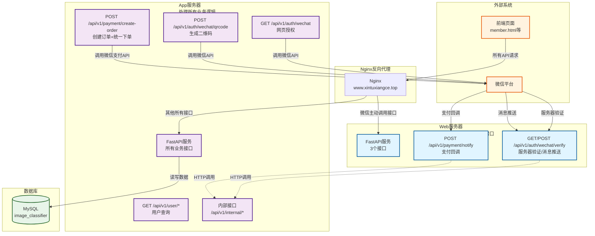
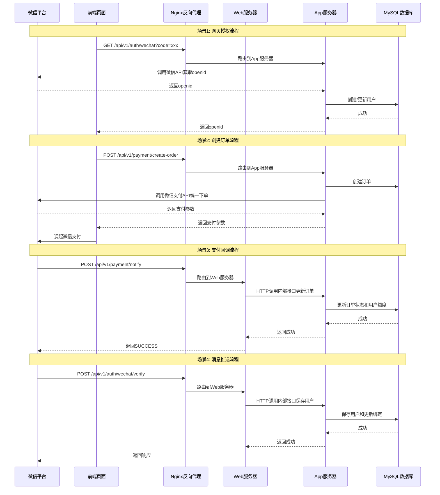
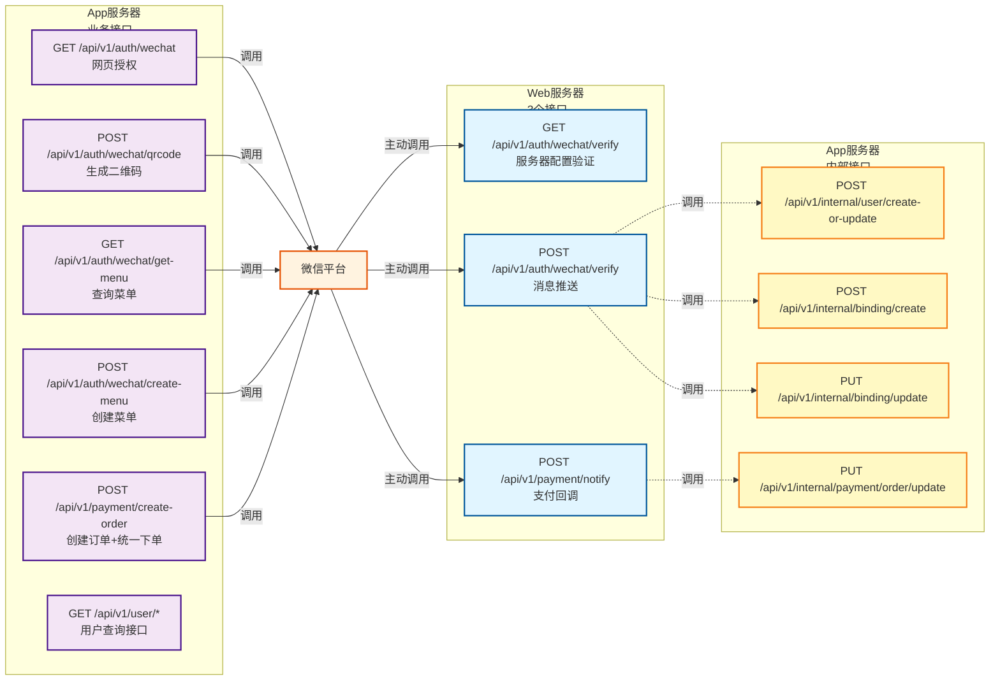
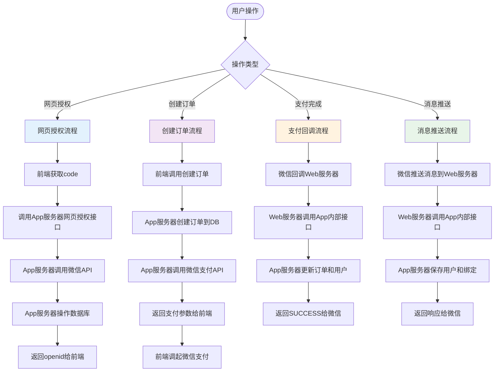
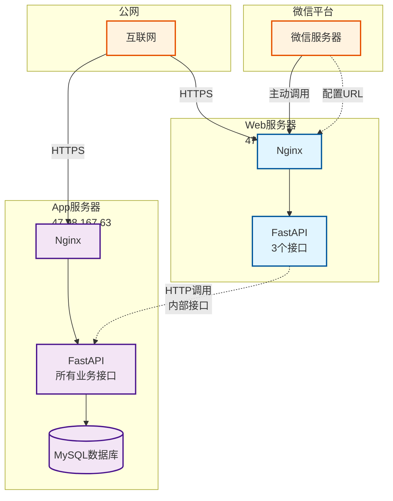

# 服务拆分架构图

## 整体架构图

## 接口调用流程图

## 接口分类图

## 数据流图

## 部署架构图

## 关键点说明

### Web服务器职责
- ✅ 只接收微信主动调用的请求（3个接口）
- ✅ 不直接操作数据库
- ✅ 通过HTTP调用App服务器的内部接口操作数据

### App服务器职责
- ✅ 处理所有业务逻辑
- ✅ 主动调用微信API（网页授权、生成二维码、统一下单等）
- ✅ 直接操作数据库
- ✅ 提供内部接口供Web服务器调用

### 优势
- ✅ 不需要修改微信平台配置（URL保持不变）
- ✅ 前端代码无需修改（通过Nginx路由）
- ✅ 职责清晰，易于维护
- ✅ 安全性更高（Web服务器不直接操作数据库）

