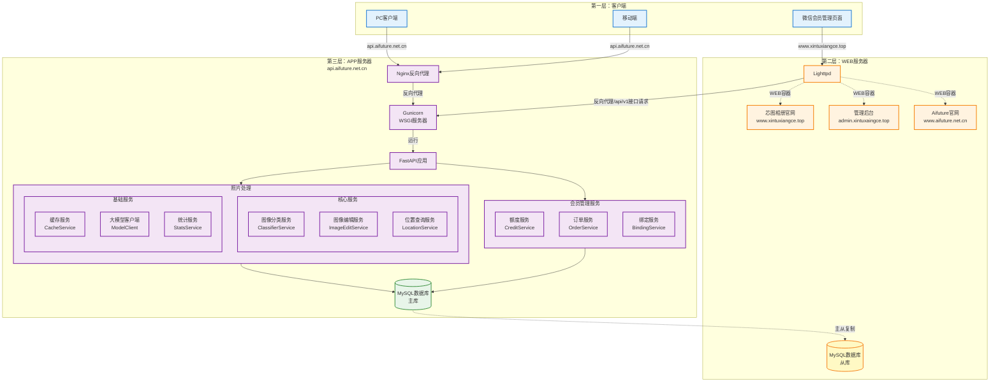
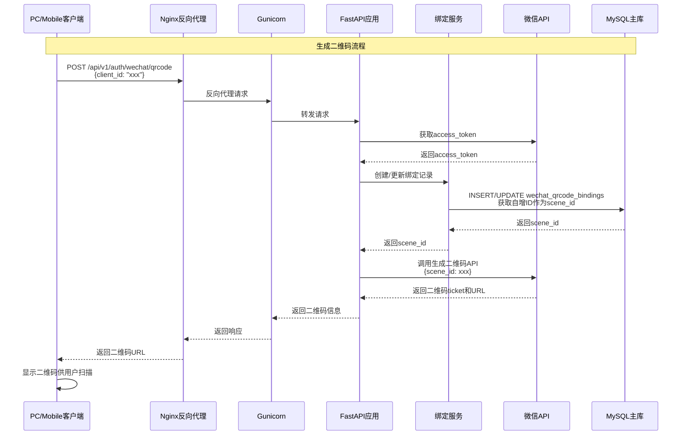
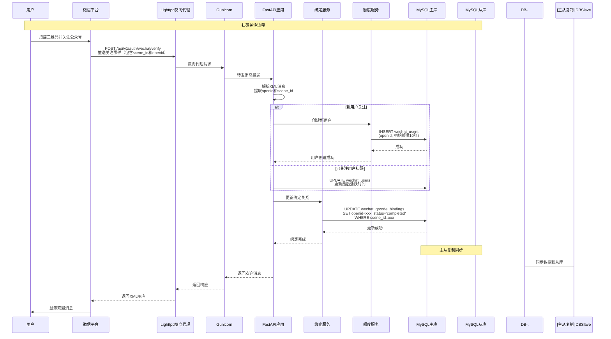
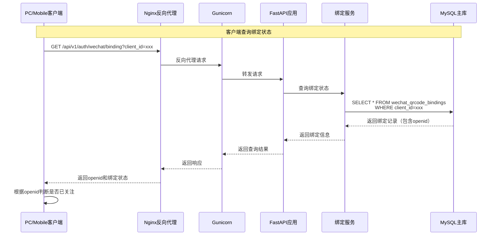
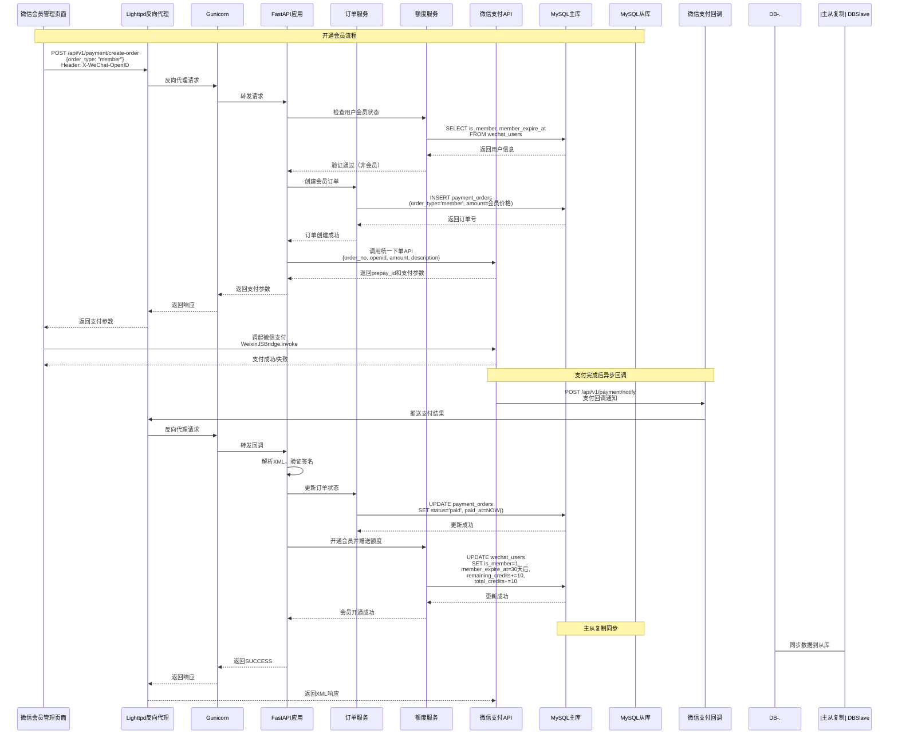
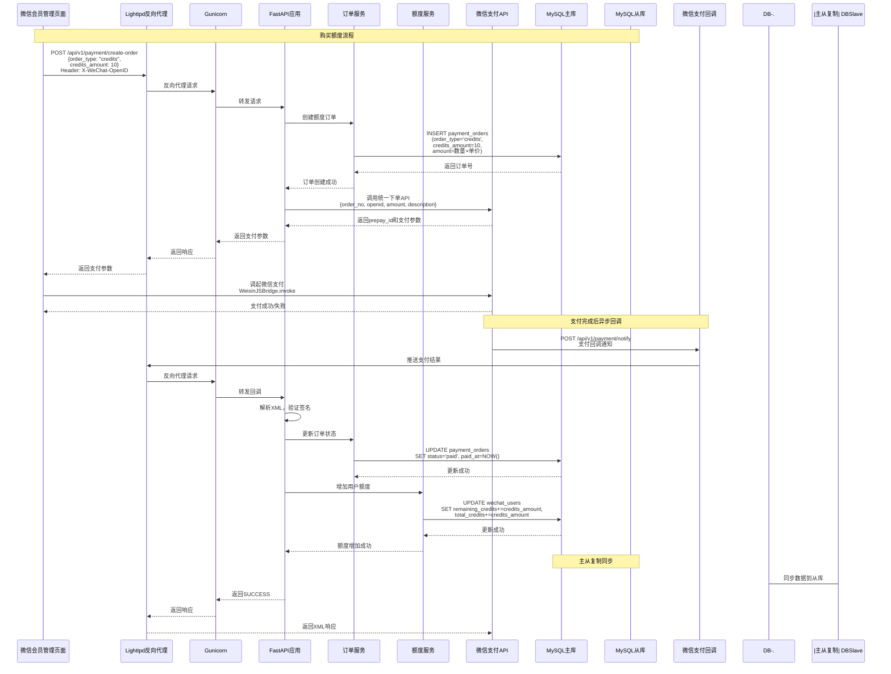

# 架构图

## 三层部署架构图



### 三层架构说明

#### 第一层：客户端
- **PC客户端**：通过 `api.aifuture.net.cn` 域名直接访问第三层APP服务器
- **移动端**：通过 `api.aifuture.net.cn` 域名直接访问第三层APP服务器
- **微信会员管理页面**：通过 `www.xintuxiangce.top` 域名访问第二层WEB服务器

#### 第二层：WEB服务器
- **Lighttpd**：Web服务器，负责处理HTTP请求和路由
  - **芯图相册官网**：Lighttpd配置的虚拟主机/Web模块
  - **管理后台**：Lighttpd配置的虚拟主机/Web模块
  - **Aifuture官网**：Lighttpd配置的虚拟主机/Web模块
- **MySQL数据库（从库）**：从第三层主库同步数据，用于只读查询
- **职责**：
  - 作为Web服务器，直接服务芯图相册官网、管理后台和Aifuture官网（通过虚拟主机配置）
  - 反向代理转发微信会员管理的API请求到第三层APP服务器的Gunicorn
  - 提供数据库从库，支持只读查询，减轻主库压力

#### 第三层：APP服务器
- **Nginx**：反向代理服务器，处理所有API请求，反向代理到Gunicorn
- **Gunicorn**：WSGI服务器，运行FastAPI应用
- **FastAPI应用**：Python Web框架，包含所有业务逻辑
- **Service服务**：业务服务模块，分为两层
  - **核心服务**：
    - **图像分类服务（ClassifierService）**：图片分类核心服务，整合缓存、大模型和本地推理
    - **图像编辑服务（ImageEditService）**：基于阿里云百炼的图像编辑功能
    - **位置查询服务（LocationService）**：基于GPS坐标的城市位置查询
  - **基础服务**：
    - **缓存服务（CacheService）**：图片分类结果缓存管理
    - **大模型客户端（ModelClient）**：调用阿里云通义千问等大模型API
    - **统计服务（StatsService）**：请求日志记录和统计数据查询
- **会员管理服务**：会员相关的业务逻辑
  - **额度服务（CreditService）**：用户额度检查和扣减
  - **订单服务（OrderService）**：订单创建、支付处理
  - **绑定服务（BindingService）**：微信二维码与客户端绑定管理
- **MySQL数据库（主库）**：数据存储，通过主从复制同步到第二层从库

### 访问路径

1. **PC/Mobile → APP服务器**
   ```
   PC/Mobile → api.aifuture.net.cn → Nginx → Gunicorn → FastAPI → Services/MemberService → DB
   ```

2. **微信会员管理 → WEB服务器 → APP服务器**
   ```
   Wechat → www.xintuxiangce.top → Lighttpd(反向代理) → Gunicorn → FastAPI → MemberService → DB
   ```

3. **访问网站 → WEB服务器（虚拟主机）**
   ```
   客户端 → www.xintuxiangce.top → Lighttpd(Web服务器) → 芯图相册官网/管理后台/Aifuture官网(虚拟主机)
   ```

## 二维码生成与扫码关注时序图

### 场景1：生成二维码流程



### 场景2：扫码关注流程



### 场景3：客户端查询绑定状态



### 场景4：开通会员流程



### 场景5：购买额度流程



## 关键点说明

### Web服务器职责
- ✅ 只接收微信主动调用的请求（3个接口）
- ✅ 不直接操作数据库
- ✅ 通过HTTP调用App服务器的内部接口操作数据

### App服务器职责
- ✅ 处理所有业务逻辑
- ✅ 主动调用微信API（网页授权、生成二维码、统一下单等）
- ✅ 直接操作数据库
- ✅ 提供内部接口供Web服务器调用

### 优势
- ✅ 不需要修改微信平台配置（URL保持不变）
- ✅ 前端代码无需修改（通过Nginx路由）
- ✅ 职责清晰，易于维护
- ✅ 安全性更高（Web服务器不直接操作数据库）

### 架构图样式说明

**Subgraph标题左对齐**：Mermaid的subgraph标题默认居中显示。如果您的Markdown渲染环境支持自定义CSS（如GitHub Pages、GitLab Pages、某些Markdown编辑器），可以在HTML中添加以下CSS样式来实现标题左对齐：

```css
.mermaid .subgraphLabel {
    text-align: left !important;
    justify-content: flex-start !important;
}

.mermaid .cluster-label text {
    text-anchor: start !important;
}
```

如果您的环境不支持自定义CSS，标题将保持默认的居中显示。

